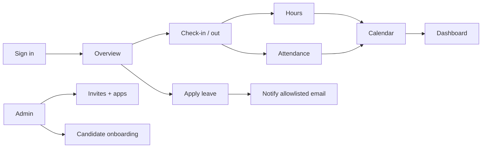

# PRD: Pulse go-live (today)

**Product:** Pulse — People OS employee workspace  
**Company:** BDA (`@bda.co.in`)  
**Document type:** Shipping requirements for **9 Sep 2026**  
**Status:** Ready to go live  
**Audience:** Founder, product, engineering, first users  
**Mode:** **Live** (not sample / demo data)

This is the source of truth for **what we ship today**. Older Phase-1 notes and the PaySlip PRD stay in the repo as history. They do not expand today’s scope.

---

## 1. One-line promise

People at BDA sign in, check in, see hours and attendance fill in, apply leave, use the calendar and dashboard, and admins invite people and run candidate onboarding.

---

## 2. Goal

Give every member a **daily loop** that is real, not a demo:

1. Sign in with company email  
2. Check in / check out  
3. Hours and attendance update from that clock  
4. See the week, calendar, and dashboard  
5. Apply leave  

Give admins enough to **invite**, **assign apps**, **audit check-in**, and **onboard candidates**.

If a screen is not in this document, do not pitch it as live today.

---

## 3. Users

| Persona | What they do today |
|--------|---------------------|
| **Member** | Sign in, check in/out, see hours/attendance, calendar, dashboard, apply leave, open assigned apps |
| **Admin** | Everything a member can do, plus Organization: invites, app grants, candidate onboarding, check-in audit |

**Roles**

- `admin` — My Space + Organization  
- `member` — My Space only  

**Email**

- Company domain: `@bda.co.in`  
- Handle is enough: `shivam` → `shivam@bda.co.in`  
- Google sign-in is available for the same domain  

---

## 4. Daily loop (happy path)

**Success in under a minute:** member knows whether they are in, how long they have worked, and whether they can apply leave.

---

## 5. In scope today (live)

### 5.1 Sign-in & account

| ID | Feature | Live behaviour |
|----|---------|----------------|
| G1 | Email / password | Login, register, forgot password |
| G2 | Company handle | `name` or `name@` completes to `name@bda.co.in` |
| G3 | Google | OAuth for company accounts |
| G4 | Invite accept | `/invite/:token` — join org, set password |
| G5 | Account | Embedded account hub in My Space |
| G6 | Theme | Light / dark |

### 5.2 Overview (home)

| ID | Feature | Live behaviour |
|----|---------|----------------|
| G7 | Greeting + week | Week strip from check-in (weekend, holiday, leave, present, absent) |
| G8 | Check-in card | Check in / out / resume; large elapsed timer; date |
| G9 | Header timer | Live time in the Pulse bar while checked in; click → Overview |
| G10 | KPIs | Timesheet hours, leave left, pending, attendance MTD from live APIs |

### 5.3 Hours (from the clock)

Hours are **logged from check-in**, not a timesheet editor.

| ID | Feature | Live behaviour |
|----|---------|----------------|
| G11 | Active time | `PulseWorkDay.activeMs` via check-in, heartbeat, desktop timer |
| G12 | Day / week hours | Overview week, Hours rail, Dashboard Hours widget |
| G13 | Target | Default 9h day / 40h week as a display target |
| G14 | Desktop timer | Electron app, bridge `127.0.0.1:39217`; idle gaps not counted |

**Not today:** Submit timesheet, approve timesheet, project/task hour entry.

### 5.4 Attendance

Thin view of the **same check-in days**. Not a separate HRMS attendance product.

| ID | Feature | Live behaviour |
|----|---------|----------------|
| G15 | My Attendance | This week present/absent, today in/out, MTD % |
| G16 | Admin audit | Organization check-in days list |
| G17 | Dashboard widget | Week present/absent + MTD |

### 5.5 Calendar

| ID | Feature | Live behaviour |
|----|---------|----------------|
| G18 | Month view | Present, absent, leave, holiday, hours per day |
| G19 | Toolbar | Prev / next + **Mon YYYY** label only (no year/month dropdowns) |
| G20 | Today | Forest-green rounded square, white numerals |

### 5.6 Dashboard (live)

| ID | Feature | Live behaviour |
|----|---------|----------------|
| G21 | Widget board | Customize, drag, refresh against live API |
| G22 | Hours + attendance | Week hours, today hours, week attendance, MTD |
| G23 | Leave + holidays | Casual used/left; sick/custom used this year; next 3 months of holidays |
| G24 | Shortcuts | Favorites / quick links open Overview, Leave, Calendar, Hours, Attendance |
| G25 | People (when data exists) | Birthdays this month, new hires (15 days), work anniversaries |
| G26 | Feed (when data exists) | Announcements, pending leave / tasks |

Empty on purpose today (no live source): **files, engagement surveys, wedding anniversaries**.

### 5.7 Leave Tracker

| ID | Feature | Live behaviour |
|----|---------|----------------|
| G27 | My Data | Leave summary + requests list |
| G28 | Apply | Casual / Sick / Custom; dates; reason; day count (same day = 1) |
| G29 | Notify | Team email from allowlist only (default `office@bda.co.in`, `hello@ambesh.com`) |
| G30 | Casual balance | Annual 18; remaining from linked staff profile |
| G31 | Import / export | XLSX/CSV import wizard; export filtered requests / holidays |
| G32 | Holidays | Holiday list + export |
| G33 | Team | Week navigator (thin; empty if nobody on leave) |

**Not today:** In-Pulse approve/reject. Shift tab is coming soon.

### 5.8 Onboarding (admin)

| ID | Feature | Live behaviour |
|----|---------|----------------|
| G34 | Candidates | Organization → Onboarding: add/edit, list, status |
| G35 | CSV | Import candidates |

**Not today:** Member My Space “Onboarding” checklist (local only). Do not sell that as HR onboarding.

### 5.9 Organization (admin)

| ID | Feature | Live behaviour |
|----|---------|----------------|
| G36 | Invites | Create / revoke; members list; admin vs member |
| G37 | App grants | Assign apps / URLs to emails |
| G38 | Assigned apps | Header icons (left of timer) open granted apps |
| G39 | Check-in audit | Org-wide days |

### 5.10 Also live (supporting)

| ID | Feature | Live behaviour |
|----|---------|----------------|
| G40 | Getting Started | Choose sample vs live (go-live users stay on **live**) |
| G41 | Notes | `/pulse/notes` — **localStorage only** |
| G42 | Sign-in look | Overview-aligned promo (peak, date/clock, Check-in / Leave / Week) |

---

## 6. Out of scope today

Do not demo or promise these as live:

| Area | Why |
|------|-----|
| **Submit timesheet** | Toast only; hours are calculated from check-in |
| **Leave approve / reject in Pulse** | Request + email notify only |
| **Payroll / payslips as Pulse home** | Legacy PaySlip is not this launch |
| **Member onboarding rail** | Local checklist, not candidate HR |
| **Performance, Files, Tasks, OKR, Travel, Letters, Compensation, Engagement** | Glass boards / local stubs |
| **Search, notifications, directory (members)** | Coming soon toasts |
| **Org Announcements / Policies / Trees / Birthdays / New hires tabs** | Stubs (dashboard can still show people dates if Staff records have them) |
| **Delegation** | Not a live module |
| **Wedding anniversaries, Files, Engagement widgets** | No live data |
| **Shift scheduling** | Coming soon |

---

## 7. What “done” looks like (acceptance)

Run these on **live** (`@bda.co.in`), not sample.

- [ ] Member signs in with handle or full email; Google works for a company account  
- [ ] Check in → header + Overview timers run; check out stops them  
- [ ] Week strip and Attendance show present after time is logged  
- [ ] Hours rail and Dashboard Hours match check-in time (today / this week)  
- [ ] Calendar month shows present / absent / leave / holiday / hours  
- [ ] Dashboard loads widgets from `/pulse-checkin/dashboard` (not empty shells)  
- [ ] Dashboard row click opens Leave, Calendar, Hours, Attendance, Overview  
- [ ] Apply Casual/Sick/Custom leave; request appears in Leave Requests; notify email attempted  
- [ ] Same-day leave counts as 1 day; casual remaining cannot go below 0 on apply  
- [ ] Admin invites a member; member accepts and lands in My Space  
- [ ] Admin can add a candidate (and CSV) under Organization → Onboarding  
- [ ] Admin can assign an app; icon appears left of the header timer  
- [ ] Electron timer keeps time if the browser is closed (optional but in scope)  
- [ ] No forest-green focus rings on selects / date pickers  
- [ ] Calendar month is prev/next + **Mon YYYY** text only  

---

## 8. Product rules (do not regress)

1. **Green is for brand fills** (Check-in, `+`, today cell, live dots). Not for focus rings on form controls.  
2. **Ant Design Select** stays a thin gray border (`#d9d9d9`); no green halo.  
3. **Hours = clock.** Do not describe Hours as a submitted timesheet.  
4. **Dashboard in live** uses APIs. Sample data is only for Getting Started → sample.  
5. **Leave mail** only to the allowlisted Team Email IDs.  

---

## 9. Technical surface (for engineering)

| Layer | Entry |
|-------|--------|
| Web | React + Vite · `PeopleHome.jsx` |
| Check-in / hours / attendance / calendar / dashboard | `GET/POST /api/pulse-checkin/*` |
| Leave | `/api/pulse-checkin/leaves` |
| Invites / apps / candidates | `invites.js`, `launcher.js`, `candidates.js` |
| Data | MongoDB · `PulseWorkDay`, `LeaveRequest`, `Staff`, users, invites |
| Desktop | `desktop/` · `127.0.0.1:39217` |

**Env for mail:** `PULSE_LEAVE_NOTIFY_EMAILS`, `EMAIL_USER` / `EMAIL_PASS`.

---

## 10. Pitch vs later

**Say today:** “Pulse is how we check in, see hours and attendance, apply leave, and look at the week on Calendar and Dashboard. Admins invite people and onboard candidates.”

**Do not say today:** “Full HRMS — performance, payroll, files, approvals inbox, org directory.”

**Next (not blocking go-live):** in-Pulse leave approve/reject, real timesheet submit, server-synced notes, org announcements as a product, dedicated attendance ops.

---

*Go-live date: 9 Sep 2026. If a feature is not listed in §5, it is not in today’s release.*
