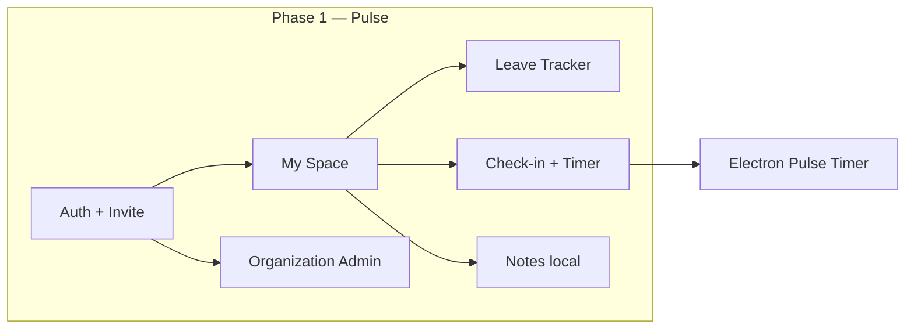

# PRD: Pulse — Phase 1

**Product:** Pulse (People OS employee workspace)  
**Document type:** Phase-1 Product Requirements  
**Status:** In progress / active build  
**Audience:** Product, design, engineering  
**Last updated:** 3 Sep 2026  

---

## 1. Summary

Pulse is the Phase-1 employee workspace for People OS. It replaces the older PaySlip Pro–centric navigation for day-to-day work: check-in, leave, overview, org invites, and a desktop timer.

**Phase-1 goal:** Give every member a clear daily loop — *Am I checked in? What happened this week? Do I have leave / approvals / notes?* — and give admins enough org tools to invite people, assign apps, and audit time.

**Out of Phase 1:** Full payroll/payslips as the primary surface, dedicated Attendance / Timesheets / Performance modules, org directory social features, and server-synced notes.

---

## 2. Problem & users

### Problem
SMBs need a lightweight people workspace that is calmer than a full HRMS, but real enough for daily attendance and leave — without forcing staff into the old admin payroll UI.

### Primary users

| Persona | Needs in Phase 1 |
|--------|-------------------|
| **Member** | Check in/out, see week status, apply leave, get notified to approvers, use notes & timer |
| **Admin** | Invite members, assign apps, onboarding candidates, audit check-ins, open Organization space |

### Roles
- `admin` — My Space + Organization
- `member` — My Space only (org directory placeholder)

---

## 3. Product principles (Phase 1)

1. **One job per day start:** Check-in is the primary action when not punched in.
2. **Live when linked, sample when exploring:** Getting Started can run demo data; live mode uses Pulse APIs.
3. **Brand discipline:** Forest green `#1A5F4A` for CTAs / active states — not focus rings on form controls.
4. **Leave notify is allowlisted:** Team Email ID only from configured addresses (no arbitrary mail).
5. **Desktop timer is first-class:** Electron bridge keeps active time accurate while the browser is closed.

---

## 4. Scope map

---

## 5. Feature requirements

### 5.1 Auth, account & onboarding

| ID | Feature | Requirement | Priority |
|----|---------|-------------|----------|
| A1 | Register / login | Email + password; profile with Pulse fields | P0 |
| A2 | Email verification / reset | SMTP-backed verify & password reset | P0 |
| A3 | OAuth | Google (and existing OAuth routes) sign-in | P1 |
| A4 | Accept invite | `/invite/:token` — join org, set password | P0 |
| A5 | Pulse setup | Company name, portal ID, industry, size via pulse setup | P0 |
| A6 | Getting Started | Guide + choose **sample** vs **live** data | P0 |
| A7 | Account hub | `/account/*` security & prefs shell | P1 |
| A8 | Domain gating | Members constrained to company email domain when configured | P1 |

**Success:** New hire can accept invite, land in My Space, and either explore sample or use live check-in.

---

### 5.2 My Space shell

| ID | Feature | Requirement | Priority |
|----|---------|-------------|----------|
| S1 | Left rail | Home, Onboarding (admin), Leave Tracker, Attendance, Timesheets, Performance, More; Operations / Reports foot | P0 |
| S2 | Space tabs | **My Space** (all); **Organization** (admin only) | P0 |
| S3 | Home sub-nav | Overview, Dashboard, Calendar, Delegation | P0 |
| S4 | Overview | Greeting, week schedule, draft timesheet banner, KPI row, activity tabs, check-in card, notes dock, quick actions | P0 |
| S5 | Dashboard | Widget grid (sample/demo-friendly); customize / drag where built | P1 |
| S6 | Calendar | Month view + custom period picker (no green focus rings) | P1 |
| S7 | Theme | Light / dark Pulse theme | P0 |
| S8 | Coming soon modules | Attendance, Timesheets, Performance, Delegation, Operations, Reports → Coming Soon (not empty crashes) | P0 |
| S9 | Zoom lock | Lock browser zoom on Pulse routes | P2 |

**Overview KPI cards (Phase 1 visual)**
- Timesheet · Leave balance · Pending on you · Attendance MTD  
- Layout: title → icon + value + soft pill → footer text  
- Soft badges (e.g. Draft / Clear), no heavy progress bars in the KPI strip  

**Success:** Member opens Pulse and understands today status in under 5 seconds.

---

### 5.3 Check-in & attendance (Phase 1 slice)

| ID | Feature | Requirement | Priority |
|----|---------|-------------|----------|
| C1 | Check-in / check-out | Create/update `PulseWorkDay` with location + IP | P0 |
| C2 | Active time sync | Heartbeat / sync updates `activeMs` | P0 |
| C3 | Day finalize | End-of-day / midnight finalize logs hours | P0 |
| C4 | 9h target | Default target hours; target-reached event | P1 |
| C5 | Overview week grid | Weekend / Absent / Today / Present states | P0 |
| C6 | In-app timer | Float + `/pulse/checkin-timer` while checked in | P0 |
| C7 | Desktop bridge | Web ↔ Electron on `127.0.0.1:39217` | P0 |
| C8 | Admin audit | Org tile + `PulseCheckInAdmin` / admin days API | P0 |

**Not Phase 1:** Full dedicated Attendance module UI, CSV attendance ops as primary Pulse UX (legacy APIs may remain).

---

### 5.4 Leave Tracker

| ID | Feature | Requirement | Priority |
|----|---------|-------------|----------|
| L1 | Tabs | My Data · Team · Holidays | P0 |
| L2 | Leave Summary | Casual (and listed) balances | P0 |
| L3 | Leave Requests | Table: type, from–to, days, status, reason; pagination | P0 |
| L4 | Apply Leave | Full-page-ish modal card: Leave type*, Date*, Team Email ID*, Reason*; Submit / Cancel | P0 |
| L5 | Day count | Show selected days in red when start/end set; same day = 1 day | P0 |
| L6 | Notify email | Dropdown allowlist (default `office@bda.co.in`, `hello@ambesh.com`); email on submit | P0 |
| L7 | Filters | Period, date range, type, leave types; drawer UX | P0 |
| L8 | Import | XLSX/XLS/CSV wizard: upload → map → verify → summary → `POST /leaves/import` | P0 |
| L9 | Export | CSV/XLSX of filtered requests / holidays | P0 |
| L10 | Empty state | Branded empty art + “No Data Found” + Add Request | P1 |
| L11 | Holidays | India holiday gallery → add to My Holidays (client); export | P1 |
| L12 | Team tab | Week navigator; empty “no team on leave” | P2 |
| L13 | Shift tab | Explicit coming soon | P2 |

**Leave types (Phase 1):** Casual Leave, Sick Leave, Custom (stored as Casual / Sick / Custom).

**Success:** Member submits leave → request persists → notify email fires (when SMTP configured) → request appears in Leave Requests after reload.

---

### 5.5 Timesheets, approvals & notes (Phase 1 slice)

| ID | Feature | Requirement | Priority |
|----|---------|-------------|----------|
| T1 | Timesheet signal | Overview draft banner + KPI from check-in hours | P0 |
| T2 | Approvals list | Overview Approvals tab / queue from overview API or sample | P1 |
| T3 | Notes | `/pulse/notes` + dock; boards / trash; **localStorage only** | P1 |
| T4 | Quick actions | Leave, Attendance, Timesheet, Directory shortcuts on Overview | P1 |

**Not Phase 1:** Full timesheet editor module, server-persisted notes, in-Pulse leave approve/reject workflow (legacy leave admin may exist separately).

---

### 5.6 Organization (admin)

| ID | Feature | Requirement | Priority |
|----|---------|-------------|----------|
| O1 | Org overview | Cover, company card, service tiles | P0 |
| O2 | Invites & members | Create/revoke invites; list members; admin/member roles | P0 |
| O3 | App grants | Assign apps/URLs to emails | P0 |
| O4 | Candidate onboarding | CRUD + CSV import candidates | P0 |
| O5 | Check-in / time audit tiles | Reuse admin check-in views | P0 |
| O6 | Other org tabs | Announcements, policies, trees, birthdays, etc. → Coming Soon | P2 |

---

### 5.7 Desktop — Pulse Timer

| ID | Feature | Requirement | Priority |
|----|---------|-------------|----------|
| D1 | Electron app | Always-on-top mini timer (macOS / Windows) | P0 |
| D2 | Bridge API | `/health`, `/state`, check-in / sync / check-out on port **39217** | P0 |
| D3 | Idle handling | ~90s idle + power suspend/resume; idle not counted as active | P0 |
| D4 | Tray | Show / tooltip Working vs idle | P1 |
| D5 | Packaging | DMG / ZIP / NSIS via electron-builder | P1 |

**Run locally:** `npm run desktop` (with backend + frontend already up).

---

## 6. Explicit non-goals (Phase 1)

- Primary UX for payslip generation, PF/ESI payroll math, KYC vault  
- Dedicated rail modules: Attendance, Timesheets, Performance, Operations, Reports, Delegation  
- Leave Team roster + Shift scheduling (beyond empty shells)  
- Holiday import  
- Real-time org chat / pins / contacts  
- Global search, help center, settings product surfaces (placeholders OK)  
- Server-backed Notes sync  

Legacy PaySlip / staff portal APIs may remain in the repo but are **not** Phase-1 Pulse destinations (many routes redirect to `/pulse`).

---

## 7. Technical context (for engineering)

| Layer | Stack / entry |
|-------|----------------|
| Web | React + Vite + Ant Design · `frontend/` · Pulse shell `PeopleHome.jsx` |
| API | Express · `backend/routes/pulseCheckIn.js`, `invites.js`, `launcher.js`, `candidates.js`, `auth.js` |
| Data | MongoDB · `PulseWorkDay`, `LeaveRequest`, Users / Staff / invites |
| Mail | Nodemailer · leave notify + invites |
| Desktop | Electron · `desktop/` · bridge `127.0.0.1:39217` |
| Theme | `pulse-antd.css`, `pulse-dark.css`, `antdTheme.js` |

**Key env (leave notify):** `PULSE_LEAVE_NOTIFY_EMAILS`, plus `EMAIL_USER` / `EMAIL_PASS` for real SMTP.

---

## 8. Phase-1 acceptance checklist

- [ ] Member can check in / out; Overview week updates; timer (web or Electron) shows active time  
- [ ] Admin can invite a member; invite email works with SMTP  
- [ ] Leave apply with type, dates, team email, reason; same-day leave = 1 day; notify email attempted  
- [ ] Leave import XLSX and export CSV/XLSX work against live API  
- [ ] Sample mode works without a linked staff profile; live mode requires linked staff for leave/check-in  
- [ ] Organization: invites, app grants, candidates, check-in audit reachable for admin  
- [ ] Coming-soon modules do not break navigation  
- [ ] KPI strip matches soft-card Phase-1 visual; leave empty state uses branded art  
- [ ] No green focus rings on Pulse selects / date pickers / calendar period controls  

---

## 9. Phase 2 candidates (parking lot)

- Dedicated Attendance & Timesheets modules  
- In-Pulse leave approve/reject for Team Email recipients  
- Server Notes sync  
- Team leave calendar + shift schedules  
- Org announcements / directory  
- Stronger approvals workflow across leave + tasks  

---

## 10. Open decisions

1. Should leave **approve** happen inside Pulse, or stay email → legacy admin?  
2. Is Notes Phase-1 “good enough” as local-only, or pull forward sync?  
3. Default notify emails: keep hard-coded allowlist vs org-admin configurable UI?  
4. When does sample mode auto-exit after first real check-in?  

---

*This document is the Phase-1 source of truth for Pulse. Older `PRD.md` (PaySlip Pro Enterprise) remains historical context for payroll/ESS — not the Phase-1 shipping checklist.*
